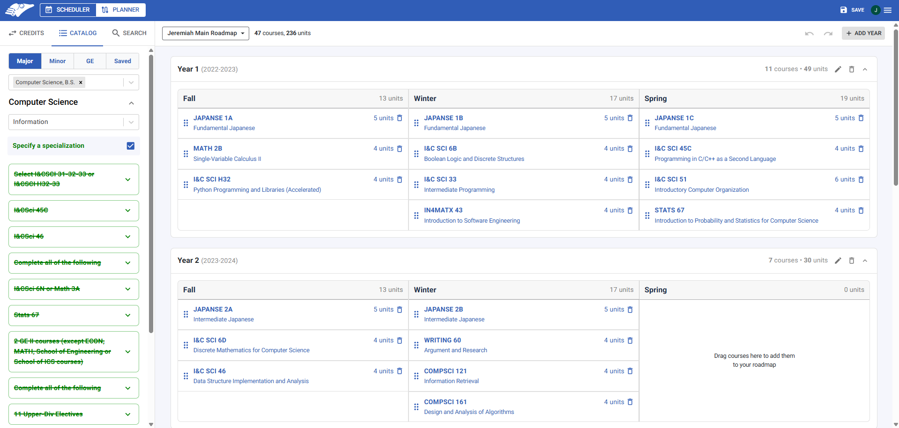
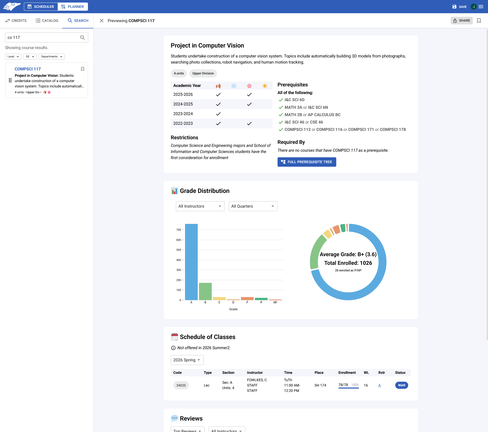

## About

AntAlmanac Planner is a web application designed to aid UCI students with course discovery and planning. We consolidate public data available on multiple UCI sources via [Anteater API](https://docs.icssc.club/docs/about/anteaterapi) to improve the user experience when planning course schedules. Features include:

- **A drag-and-drop multi-year course planner**:
  - Select multiple majors and minors
  - Import your unofficial transcript via [StudentAccess](https://www.reg.uci.edu/access/student/transcript/?seg=U) to automatically fill in your roadmap to date
  - View how your planned roadmap fulfills your **major**, **specialization**, **minor**, and **GE** requirements
  - Import any **transferred courses**, **AP exams**, and **GE/Elective credits**

- **Course Search**:
  - Recent offerings 
  - Grade distribution visualizations
  - Visual prerequisite tree
  - Historic Schedule of Classes data
  - Reviews from UCI students

- **Instructor Search**:
  - Grade distribution visualizations
  - Historic Schedule of Classes data
  - Reviews from UCI students
  

## Technology

### Frontend
- [React](https://react.dev/) - Library to build dynamic, component-based UIs.
- [Next.js](https://nextjs.org/) - React framework with server-side rendering.
- [Material UI](https://mui.com/material-ui/) - React component library that implements Google's Material Design. 

### Backend
- [Anteater API](https://github.com/icssc/anteater-api) - API maintained by ICSSC for retrieving UCI data.
- [Express](https://expressjs.com/) - Minimalist backend framework for Node.js.
- [tRPC](https://trpc.io/) - Library for type-safe APIs.
- [PostgreSQL](https://www.postgresql.org/) - Relational database for storing user data and planners.
- [Drizzle ORM](https://orm.drizzle.team/) - high-performance type-safe SQL-like access layer.

### Tooling
- [SST](https://sst.dev/) - Infrastructure as code framework for AWS deployment.
- [TypeScript](https://www.typescriptlang.org/) - JavaScript with type-checking.

## History
AntAlmanac Planner was originally created in 2020 under the name **PeterPortal** by a team of ICSSC Projects Committee members led by @uci-mars, aiming to unify fragmented course information and long-term planning resources in one application.

In February 2026, PeterPortal [merged](https://docs.icssc.club/docs/about/antalmanac/merge) with [AntAlmanac](https://github.com/icssc/AntAlmanac/) into one ultimate course planning platform. Following the merger, PeterPortal was rebranded as **AntAlmanac Planner**, while the original AntAlmanac became **AntAlmanac Scheduler**.

| Year           | Project Lead                                         |
| -------------- | ---------------------------------------------------- |
| 2020 - 2021    | [@uci-mars](https://github.com/uci-mars)             |
| 2021 - 2022    | [@chenaaron3](https://github.com/chenaaron3)         |
| 2022 - 2023    | [@ethanwong16](https://github.com/ethanwong16)       |
| 2023 - 2024    | [@js0mmer](https://github.com/js0mmer)               |
| 2024 - 2025    | [@Awesome-E](https://github.com/Awesome-E)           |
| 2025 - Present | [@CadenLee2](https://github.com/CadenLee2)           |

## Contributing
We welcome all open-source contributions! A guide on how to contribute can be found on the Getting Started tab.
