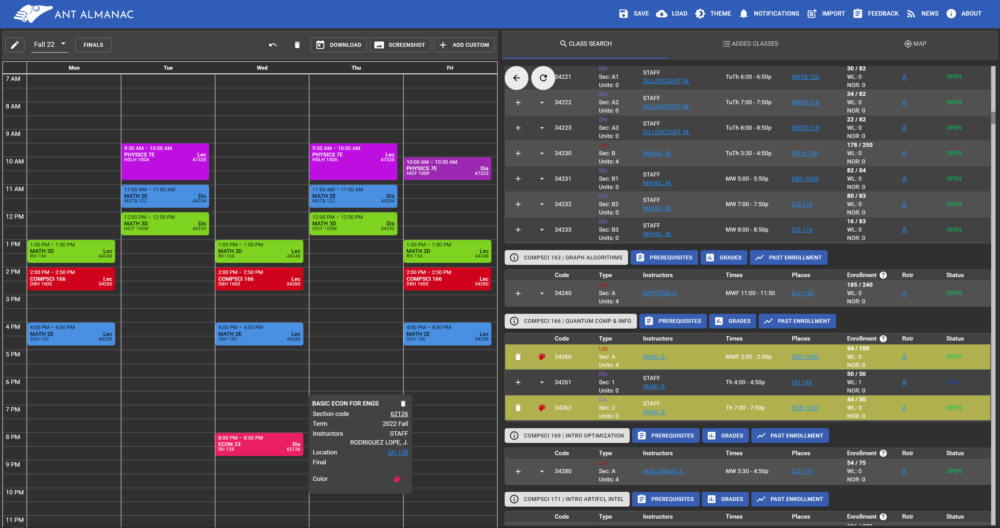

## About

AntAlmanac is a schedule planner website for classes at UC Irvine. These are some of its features:

-   **_Search bar_** to easily find classes by department (e.g COMPSCI), course code (e.g. ICS 31), and keywords (e.g. artificial intelligence).
-   **_Integrated calendar_** to preview class times.
-   **_Quick links_** to professor reviews, prerequisites, grade distributions, and past enrollment data.
-   **_Interactive map_** with markers for your class locations.

## Technology

Our website is a single page React application hosted on Github Pages.
A summary of the libraries we use are listed below.

### Frontend

-   [MUI](https://mui.com) - React UI library.
-   [React Big Calendar](https://github.com/jquense/react-big-calendar) - React calendar component.
-   [Recharts](https://recharts.org/en-US) - React chart component.
-   [Leaflet](https://leafletjs.com) - Interactive JS maps.
-   [Zustand](https://docs.pmnd.rs/zustand/getting-started/introduction) - State management.

### Backend

-   [tRPC](https://trpc.io) - type-safe API access layer for the AntAlmanac API.
-   [PeterPortal API](https://api.peterportal.org) - API maintained by ICSSC for retrieving UCI data.

### Tooling

-   [Vite](https://vitejs.dev) - Blazingly fast, modern bundler.
-   [Vitest](https://vitest.dev) - Test runner.
-   [AWS](https://aws.amazon.com) - Website deployment and hosting.
-   [TypeScript](https://www.typescriptlang.org) - JavaScript with type-checking.

## History

AntAlmanac was created in 2018 by a small group of students under the leadership of [@the-rango](https://github.com/the-rango).  
They formed an AntAlmanac club to recruit other students and work on new features,
so that the website would live on even after its makers graduated.

In 2019, [@devsdevsdevs](https://github.com/devsdevsdevs) took over as AntAlmanac Project Lead and oversaw a massive rewrite of the codebase,
laying the foundation for the AntAlmanac that we know and love today.

In 2020, AntAlmanac was adopted by the ICSSC Projects Committee, which continues to provide funding, marketing, and engineering
to support the growing number of users and open-source developers that make up our AntAlmanac Community.

Since then, the project has continued to evolve and grow with successive generations of projects committee members!

| Year           | Project Lead                                         |
| -------------- | ---------------------------------------------------- |
| 2018 - 2019    | [@the-rango](https://github.com/the-rango) (founder) |
| 2019 - 2021    | [@devsdevsdevs](https://github.com/devsdevsdevs)     |
| 2021 - 2022    | [@ChaseC99](https://github.com/chasec99)             |
| 2022 - 2024    | [@EricPedley](https://github.com/EricPedley)         |
| 2023 - Present | [@ap0nia](https://github.com/ap0nia)                 |
| 2024 - Present | [@MinhxNguyen7](https://github.com/MinhxNguyen7)     |
| 2024 - Present | [@adcockdalton](https://github.com/adcockdalton)     |

## Contributing

We welcome open-source contributions 🤗.
A guide on how to contribute can be found on the Getting Started tab.
