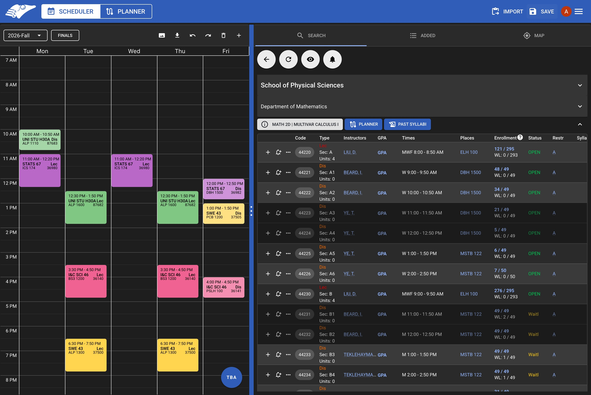

## About

AntAlmanac Scheduler is a quarterly schedule planner for classes at UC Irvine. Features include:

- **Search** for classes by department, section code, and keywords.
- **Preview** class times on the _integrated calendar_.
- **Quickly access** course statistics, reviews, and prerequisites.
- **Locate** your class locations on the _interactive map_.

## Contributing

We welcome open-source contributions 🤗.
A guide on how to contribute can be found on the [Getting Started](./getting-started.mdx) tab.
