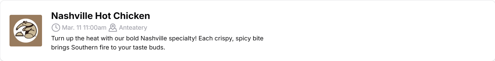

## Image

## Summary
Event Card represents a dining hall's upcoming event. This card is clickable, 
popping up [Event Dialog](#event-dialog).

Extends [Dialog](https://ui.shadcn.com/docs/components/dialog), 
[Card](https://ui.shadcn.com/docs/components/card).

## Props
| Prop Name | Prop Type | Summary |
| - | - | - |
| `name` | `string` | The name of the event.|
| `shortDesc` | `string` | A short (~120 character) description of the event.|
| `longDesc` | `string` | A full-length description of the event.|
| `imgSrc` | `string` | A URL to the image for the event. |
| `alt` | `string` | Alt text for the event's image. |
| `time` | `Date` | The start time of the event. |
| `location` | `EventLocation` (`enum`) | The binary (0 or 1) location of the event. See `EventLocation` defined in `event-card.tsx`.|
